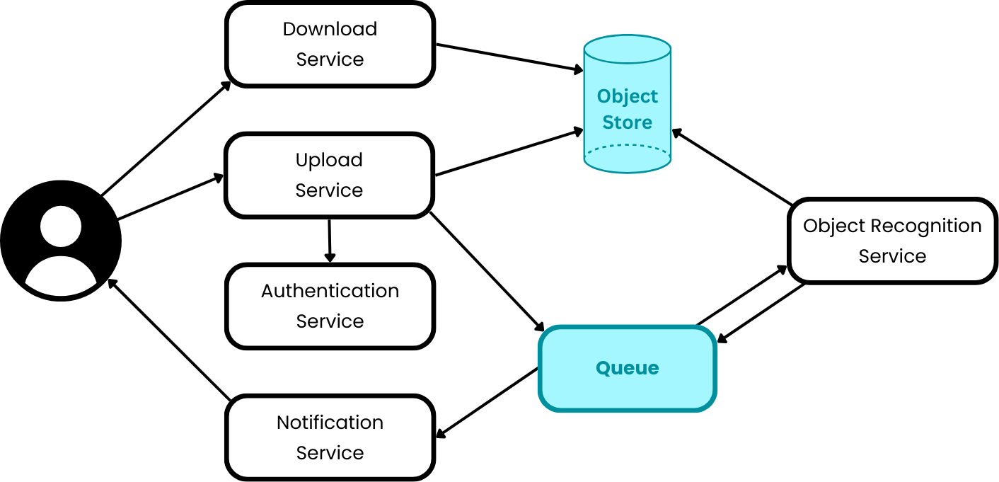

# Water bottler 
This project is a project for the course "Cloud Computing" at the Hochschule der Medien. It should be look at with a wink since it's not a polished, production ready and useful application but rather a playgroud for us to learn more about technologies (like kubernetes) used in the cloud computing world.

The idea behind the application is a scalabe system that replaces beer containers with water bottles using a microservice architecture in order to scale as needed.

## Architecture & Flow
The application is built using a microservice architecture and is composed of the following services:

* Authentication Service: A service that used for authentication. Its responsiblity is to authenticate API-Tokens and fetch their associated metadata

* Upload Service: A service that exposes an API so the user can upload their image. It will validate the API-Key and retrieve the users metadata, store the provided image in the object store and create a new job in the job queue.

* Object Recognition Service: A service that consumes the job queue and processes the uploaded images. It will use an object detection model to detect the bounding boxes of beer containers in the image and overlay them with water bottles. It will then store the processed image in the object store and mark the job as completed (seperate queue).

* Notification Service: A service that consumes the completed job queue and sends a notification to the user via email.

* Download Service: A service that exposes an API so the user can download their processed image.

## Quick start
- [Local Development](./docs/local-dev.md)
- [Cluster Deployment](./docs/cluster-deployment.md)

## Additional
- [Technical Rambling](./docs/technical-details.md)

