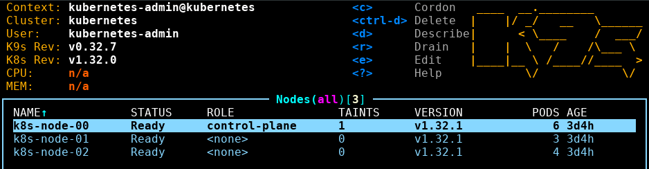

# Cluster Deployment

## Table of contents
- [Cluster Deployment](#cluster-deployment)
  - [Table of contents](#table-of-contents)
- [Bare Metal installation](#bare-metal-installation)
  - [Disable swap](#disable-swap)
  - [Install containerd](#install-containerd)
    - [Enable cgroups](#enable-cgroups)
  - [Install kubernetes relevant binaries](#install-kubernetes-relevant-binaries)
    - [Import kubernetes key](#import-kubernetes-key)
    - [Install kubernetes binaires](#install-kubernetes-binaires)
    - [Enable kubelet](#enable-kubelet)
      - [Optional: Pre-pull the kubernetes images](#optional-pre-pull-the-kubernetes-images)
    - [Test if a cluster could be initialized](#test-if-a-cluster-could-be-initialized)
- [Initialize the master node](#initialize-the-master-node)
  - [Get the default K8s config](#get-the-default-k8s-config)
  - [Install networking and network policy](#install-networking-and-network-policy)
    - [Install flannel required binaries](#install-flannel-required-binaries)
    - [Get the flannel configuration](#get-the-flannel-configuration)
- [Troubleshooting](#troubleshooting)
  - [Fix coreDNS](#fix-coredns)

# Bare Metal installation

**DISCLAIMER**
All commands are executed as the root user, please adjust the commands accordingly if you are using a different user.
This setup uses two subnets for the communication between the nodes. 
Keep in mind that every cluster environment is different and the setup might not work for your environment.

The first subnet is used for the communication between the nodes and the host.
The second subnet is used for the communication between the pods.

The network setup is as follows:
- Subnet 1: `172.30.0.1/16`
- Subnet 2: `172.31.0.1/16`

The setup is as follows:
- One master node with the IP `172.30.0.2`
- Two worker nodes with the IPs `172.30.0.3` and `172.30.0.4` respectively

## Disable swap
Swap has to be disabled on all nodes in order to run kubelet. 
```bash
swapoff -a
sed -i '/ swap / s/^\(.*\)$/#\1/g' /etc/fstab
```

Check if the module `overlay` and `br_netfilter` are loaded.
```bash
lsmod | grep overlay
lsmod | grep br_netfilter
```

Use modprobe to load the modules if they are not loaded.
```bash
modprobe overlay 
modprobe br_netfilter
```

Add the modules to the kernel modules.
```bash
cat <<EOF | tee /etc/modules-load.d/containerd.conf 
overlay 
br_netfilter
EOF
```

Add the following lines to the sysctl configuration, to guarantee that the iptables rules are applied correctly.
```bash
cat <<EOF | tee /etc/sysctl.d/99-kubernetes-k8s.conf
net.bridge.bridge-nf-call-iptables = 1
net.ipv4.ip_forward = 1 
net.bridge.bridge-nf-call-ip6tables = 1 
EOF
```

Apply the sysctl configuration.
```bash
sysctl --system
```

## Install containerd
```bash
apt -y install containerd
```

### Enable cgroups
Enable the systemd cgroup driver, otherwise the kubelet will not start.
First load the extended default configuration of containerd, then change the `SystemdCgroup` to `true`.
```bash
containerd config default > /etc/containerd/config.toml
sed -i 's/SystemdCgroup = false/SystemdCgroup = true/' /etc/containerd/config.toml
```

Restart containerd to reload the config
```bash
systemctl restart containerd
```

## Install kubernetes relevant binaries
```bash
apt-get install -y apt-transport-https ca-certificates curl gnupg
```

### Import kubernetes key
```bash
curl -fsSL https://pkgs.k8s.io/core:/stable:/v1.32/deb/Release.key | gpg --dearmor -o /etc/apt/keyrings/kubernetes-apt-keyring.gpg
chmod 644 /etc/apt/keyrings/kubernetes-apt-keyring.gpg
echo 'deb [signed-by=/etc/apt/keyrings/kubernetes-apt-keyring.gpg] https://pkgs.k8s.io/core:/stable:/v1.32/deb/ /' | tee /etc/apt/sources.list.d/kubernetes.list
chmod 644 /etc/apt/sources.list.d/kubernetes.list
apt update
```

### Install kubernetes binaires
```bash
apt-get install -y kubelet kubeadm kubectl
```

### Enable kubelet
```bash
systemctl enable --now kubelet
```

#### Optional: Pre-pull the kubernetes images
```bash
kubeadm config images pull
```

### Test if a cluster could be initialized
```bash 
kubeadm init --dry-run
```

# Initialize the master node

## Get the default K8s config
```bash
kubeadm config print init-defaults > kubeadm-config.yaml
```

Edit the `kubeadm-config.yaml` to match the network setup.
```yaml
...
localAPIEndpoint:
  advertiseAddress: 172.30.0.2
...
nodeRegistration:
  name: K8s-Node-01
...
apiServer:
  certSANs:
    - 172.30.0.2
    - 192.168.178.171
...
networking:
  dnsDomain: cluster.local
  serviceSubnet: 10.96.0.0/12
  podSubnet: 172.31.0.0/16
```

Initialize the master node with the edited configuration.
```bash
kubeadm init --config /root/kubeadm-config.yaml
```

## Install networking and network policy 
Checkout the [kubernetes docs](https://kubernetes.io/docs/concepts/cluster-administration/addons/) to choose a CNI plugin.
This is required to allow the pods to communicate with each other. If non is installed, the nodes will show as `NotReady` in the cluster.
This setup uses flannel as the CNI plugin.

### Install flannel required binaries
To install cni, the code snippet can be found in flannel's [readme](https://github.com/flannel-io/flannel/blob/master/README.md).
```bash
ARCH=$(uname -m)
  case $ARCH in
    armv7*) ARCH="arm";;
    aarch64) ARCH="arm64";;
    x86_64) ARCH="amd64";;
  esac
mkdir -p /opt/cni/bin
curl -O -L https://github.com/containernetworking/plugins/releases/download/v1.6.0/cni-plugins-linux-$ARCH-v1.6.0.tgz
tar -C /opt/cni/bin -xzf cni-plugins-linux-$ARCH-v1.6.0.tgz
systemctl restart containerd
```

### Get the flannel configuration
```bash
wget https://github.com/flannel-io/flannel/releases/latest/download/kube-flannel.yml
```

Edit the flannel configuration to match the network setup.
```yaml
apiVersion: v1
data:
  net-conf.json: |
    {
      "Network": "172.31.0.0/16",
      "EnableNFTables": false,
      "Backend": {
        "Type": "vxlan"
      }
    }
```

Apply the flannel configuration.
```bash
kubectl apply ./kube-flannel.yml
```

A healthy cluster should show the following output.
```bash
kubectl get nodes

NAME          STATUS   ROLES           AGE    VERSION
k8s-node-00   Ready    control-plane   3d4h   v1.32.1
k8s-node-01   Ready    <none>          3d4h   v1.32.1
k8s-node-02   Ready    <none>          3d4h   v1.32.1
```

We recomment to use k9s to monitor the cluster, as it is most superior to the kubectl command and also improves terminal-only workflows.


# Troubleshooting

## Fix coreDNS
If you experience any issues with coreDNS e.g.
```bash
kubectl logs --namespace=kube-system -l k8s-app=kube-dns

[ERROR] plugin/errors: ... HINFO: read udp SERVICE_IP->DNS_IP: read: no route to host
```

Manually restart the rollout of the coreDNS pods[^1]
```bash
kubectl -n kube-system rollout restart deployment coredns
```

---
Sources:
- https://kubernetes.io/docs/setup/production-environment/tools/kubeadm/install-kubeadm/
- https://www.cherryservers.com/blog/deploy-kubernetes-on-bare-metal

[^1]: kubernetes-pods-cant-resolve-hostnames, https://stackoverflow.com/questions/45805483/kubernetes-pods-cant-resolve-hostnames
