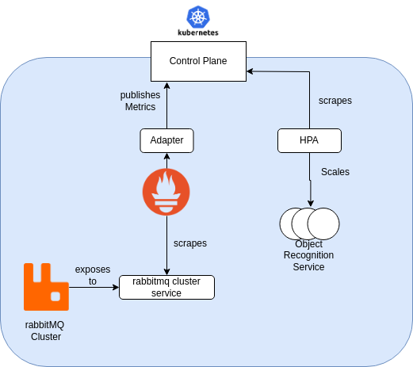

# Technical Documentation

## 1. Local dev

### 1.1 Docker compose

There is a simple docker compose setup for the application. However, development using docker compose should only be used when development using minikube is not possible.

#### Requirements

- [docker](https://docs.docker.com/engine/install/)

#### Running the application

```sh
    docker compose up -d
```

This should start all services. Relevant ports are:

- 8081 (upload service)
- 3111 (rabbitmq web interface with login values water:bottler)
- 80 (smtp4dev web interface)

### 1.2 k8s

To enable local development that already takes the k8s deployment into consideration we use minikube.

#### Requirements

- [Minikube](https://github.com/kubernetes/minikube)
- [kubectl](https://kubernetes.io/docs/tasks/tools/)
- [docker](https://docs.docker.com/engine/install/)
- [helm]()

#### Starting

Start your local cluster using minikube:

```sh
    minikube start 
```
    Optionally you can specify the resource amount the cluster should use. 
    Use `minikube start --help` for more information.

Build all images of local services into the cluster using the script:

```sh
    sh ./build-all-local.sh
```

This publishes the version of your local services to the cluster. However, in some cases this may not be needed i.e. if you want to use the image versions published to ghcr.

#### Running the application

Use helm (run this within the `helm-chart` directory):

```sh
    helm repo add bitnami https://charts.bitnami.com/bitnami
    helm repo add prometheus-community https://prometheus-community.github.io/helm-charts
    helm repo add ingress-nginx https://kubernetes.github.io/ingress-nginx
    helm dependency build
    helm install release-name .
```

Further details can be found in the helm-chart [readme](../helm-chart/README.md).

To get the adress of a service use:
```sh
    # for upload service
    minikube service upload-service --url 
```

###### Optional: Ingress usage 

To use ingress instead of the service forwarding the minikube plugin has to be used.

For this, the ingress has to be enabled in the values.yaml. Then:

```sh
    minikube addons enable ingress
    # Validate the ingress works as intended
    curl --resolve "smtp4dev.water-bottler.local:80:$( minikube ip )" -i http://smtp4dev.water-bottler.local:80/
    # Upload an image using the ingress
    curl -X POST -F image=@<image path here> -H "X-API-KEY: amVmZnMtd2F0ZXItYm90dGxlci1leGFtcGxlLWFwaS1rZXk=" --resolve "upload.water-bottler.local:80:$( minikube ip )" upload.water-bottler.local/upload -s -o /dev/null -w "%{http_code}"
```

For further info on ingresses in minikube see the [docs](https://kubernetes.io/docs/tasks/access-application-cluster/ingress-minikube/).


#### Using the application

To upload an image an API request needs to be sent to the upload service.
After processing, the image can be downloaded from the download service using the url received via email.
In a local development environment the steps are as follows:

1. Ensure that port forwarding is set up. We will use port mapping equal to the docker compose stack:
```sh
    kubectl port-forward service/upload-service 8081:8080 &
    kubectl port-forward service/download-service 8083:8080 &
    kubectl port-forward service/smtp4dev 80:80 &
```

2. Send an image of your choice to the upload service (port 8081). There are some example images in the `object-recognition-service/example-data/example-images/`  directory:

```sh
    curl -X POST -F image=@<image path here> -H "X-API-KEY: amVmZnMtd2F0ZXItYm90dGxlci1leGFtcGxlLWFwaS1rZXk=" localhost:8081/upload -s -o /dev/null -w "%{http_code}"
    # Should return 202
```

3. Wait for the email to be sent to smtp4dev. Just check the [email inbox](http://localhost:80) in you browser. You should receive a 'Your Image is ready' email shortly.

4. Go to the link within the email and download your processed image! (The link should look similar to this one `http://localhost:8083/download?file=`)


## 2. Cluster Deployment

### 2.1 Bare Metal installation

**DISCLAIMER:**
All commands are executed as the root user, please adjust the commands accordingly if you are using a different user.
This setup uses two subnets for the communication between the nodes.
Keep in mind that every cluster environment is different and the setup might not work for your environment.

The first subnet is used for the communication between the nodes and the host.
The second subnet is used for the communication between the pods.

The network setup is as follows:
- Subnet 1: `172.30.0.1/16`
- Subnet 2: `172.31.0.1/16`

The setup is as follows:
- One master node with the IP `172.30.0.2`
- Two worker nodes with the IPs `172.30.0.3` and `172.30.0.4` respectively

#### Disable swap
Swap has to be disabled on all nodes in order to run kubelet.
```bash
    swapoff -a
    sed -i '/ swap / s/^\(.*\)$/##\1/g' /etc/fstab
```

Check if the module `overlay` and `br_netfilter` are loaded.
```bash
    lsmod | grep overlay
    lsmod | grep br_netfilter
```

Use modprobe to load the modules if they are not loaded.
```bash
    modprobe overlay 
    modprobe br_netfilter
```

Add the modules to the kernel modules.
```bash
    cat <<EOF | tee /etc/modules-load.d/containerd.conf 
    overlay 
    br_netfilter
    EOF
```

Add the following lines to the sysctl configuration, to guarantee that the iptables rules are applied correctly.
```bash
    cat <<EOF | tee /etc/sysctl.d/99-kubernetes-k8s.conf
    net.bridge.bridge-nf-call-iptables = 1
    net.ipv4.ip_forward = 1 
    net.bridge.bridge-nf-call-ip6tables = 1 
    EOF
```

Apply the sysctl configuration.
```bash
    sysctl --system
```

#### Install containerd
```bash
    apt -y install containerd
```

##### Enable cgroups
Enable the systemd cgroup driver, otherwise the kubelet will not start.
First load the extended default configuration of containerd, then change the `SystemdCgroup` to `true`.
```bash
    containerd config default > /etc/containerd/config.toml
    sed -i 's/SystemdCgroup = false/SystemdCgroup = true/' /etc/containerd/config.toml
```

Restart containerd to reload the config
```bash
    systemctl restart containerd
```

#### Install kubernetes relevant binaries
```bash
    apt-get install -y apt-transport-https ca-certificates curl gnupg
```

##### Import kubernetes key
```bash
    curl -fsSL https://pkgs.k8s.io/core:/stable:/v1.32/deb/Release.key | gpg --dearmor -o /etc/apt/keyrings/kubernetes-apt-keyring.gpg
    chmod 644 /etc/apt/keyrings/kubernetes-apt-keyring.gpg
    echo 'deb [signed-by=/etc/apt/keyrings/kubernetes-apt-keyring.gpg] https://pkgs.k8s.io/core:/stable:/v1.32/deb/ /' | tee /etc/apt/sources.list.d/kubernetes.list
    chmod 644 /etc/apt/sources.list.d/kubernetes.list
    apt update
```

##### Install kubernetes binaires
```bash
    apt-get install -y kubelet kubeadm kubectl
```

##### Enable kubelet
```bash
    systemctl enable --now kubelet
```

###### Optional: Pre-pull the kubernetes images
```bash
    kubeadm config images pull
```

##### Test if a cluster could be initialized
```bash 
    kubeadm init --dry-run
```

### 2.2 Initialize the master node

#### Get the default K8s config
```bash
    kubeadm config print init-defaults > kubeadm-config.yaml
```

Edit the `kubeadm-config.yaml` to match the network setup.
```yaml
...
localAPIEndpoint:
  advertiseAddress: 172.30.0.2
...
nodeRegistration:
  name: K8s-Node-01
...
apiServer:
  certSANs:
    - 172.30.0.2
    - 192.168.178.171
...
networking:
  dnsDomain: cluster.local
  serviceSubnet: 10.96.0.0/12
  podSubnet: 172.31.0.0/16
```

Initialize the master node with the edited configuration.
```bash
    kubeadm init --config /root/kubeadm-config.yaml
```

#### Install networking and network policy
Checkout the [kubernetes docs](https://kubernetes.io/docs/concepts/cluster-administration/addons/) to choose a CNI plugin.
This is required to allow the pods to communicate with each other. If none is installed, the nodes will show as `NotReady` in the cluster.
This setup uses flannel as the CNI plugin.

##### Install flannel required binaries
To install cni, the code snippet can be found in flannel's [readme](https://github.com/flannel-io/flannel/blob/master/README.md).
```bash
    ARCH=$(uname -m)
      case $ARCH in
        armv7*) ARCH="arm";;
        aarch64) ARCH="arm64";;
        x86_64) ARCH="amd64";;
      esac
    mkdir -p /opt/cni/bin
    curl -O -L https://github.com/containernetworking/plugins/releases/download/v1.6.0/cni-plugins-linux-$ARCH-v1.6.0.tgz
    tar -C /opt/cni/bin -xzf cni-plugins-linux-$ARCH-v1.6.0.tgz
    systemctl restart containerd
```

##### Get the flannel configuration
```bash
    wget https://github.com/flannel-io/flannel/releases/latest/download/kube-flannel.yml
```

Edit the flannel configuration to match the network setup.
```yaml
apiVersion: v1
data:
  net-conf.json: |
    {
      "Network": "172.31.0.0/16",
      "EnableNFTables": false,
      "Backend": {
        "Type": "vxlan"
      }
    }
```

Apply the flannel configuration.
```bash
    kubectl apply ./kube-flannel.yml
```

A healthy cluster should show the following output.
```bash
    kubectl get nodes
    
    NAME          STATUS   ROLES           AGE    VERSION
    k8s-node-00   Ready    control-plane   3d4h   v1.32.1
    k8s-node-01   Ready    <none>          3d4h   v1.32.1
    k8s-node-02   Ready    <none>          3d4h   v1.32.1
```

We recommend to use k9s to monitor the cluster, as we rate it most superior to the kubectl command, and it also improves terminal-only workflows.


###  2.3 Troubleshooting

#### Fix coreDNS
If you experience any issues with coreDNS e.g.
```bash
    kubectl logs --namespace=kube-system -l k8s-app=kube-dns
    
    [ERROR] plugin/errors: ... HINFO: read udp SERVICE_IP->DNS_IP: read: no route to host
```

Manually restart the rollout of the coreDNS pods[^1]
```bash
    kubectl -n kube-system rollout restart deployment coredns
```

## 3. Technical Details

### Autoscaling

We utilize the [Kubernetes Horizontal Pod Autoscaler](https://kubernetes.io/docs/tasks/run-application/horizontal-pod-autoscale/) (HPA) to scale our object recognition service based on the current state of our queue. When the load in the queue exceeds a configurable threshold, additional instances of the object recognition service are created.

While Kubernetes makes it easy to set up autoscaling using HPAs, there are certain limitations. The HPA can only be configured to use metrics provided by the Kubernetes control plane, meaning it can only leverage metrics that are well-known to Kubernetes. In many cases, this is sufficient — for example, metrics like CPU utilization from the pods. However, more specific metrics, such as the number of messages in a RabbitMQ queue, are not natively supported.

To address this, we need to publish RabbitMQ metrics as custom metrics into the Kubernetes control plane. This requires the following steps:

1. Scrape the metrics from the RabbitMQ pods.
2. Store these metrics in a data store.
3. Forward the metrics to the Kubernetes control plane.



Fortunately, this is a common issue with established solutions. We will use the Prometheus Helm chart environment because it provides an easy-to-use cluster operator, an adapter between Prometheus and the Kubernetes control plane, and—well—Prometheus is the de facto standard for most metric-related tasks (outside enterprise environments where tools like Datadog are commonly used).

This allows us to address the steps above with the following tools:

- The `ServiceMonitor` provided by the community Helm chart `kube-prometheus-stack` enables us to scrape metrics from the service instead of individual pods. This is particularly beneficial because our RabbitMQ solution is a RabbitMQ cluster, which may consist of multiple pods. Using a `ServiceMonitor` avoids the complications that could arise with a `PodMonitor` in this scenario.
- The `kube-prometheus-stack` solution automatically starts a Prometheus instance, which we will use to store all our metrics.
- The Prometheus adapter allows us to publish metrics to the Kubernetes control plane.

And voilà: Our RabbitMQ metrics are now in the Kubernetes control plane, and our HPA can use them just like any other metric.

