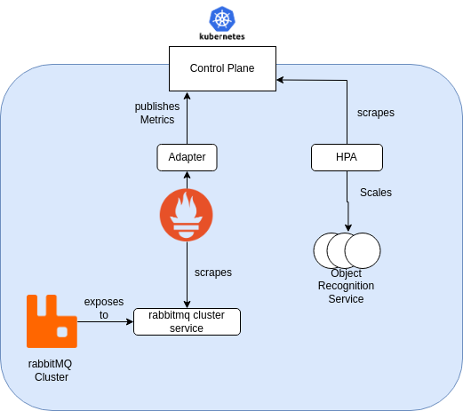

# Technical Details

A general collection of technical details and side notes.

## Autoscaling

We utilize the [Kubernetes Horizontal Pod Autoscaler](https://kubernetes.io/docs/tasks/run-application/horizontal-pod-autoscale/) (HPA) to scale our object recognition service based on the current state of our queue. When the load in the queue exceeds a configurable threshold, additional instances of the object recognition service are created.

While Kubernetes makes it easy to set up autoscaling using HPAs, there are certain limitations. The HPA can only be configured to use metrics provided by the Kubernetes control plane, meaning it can only leverage metrics that are well-known to Kubernetes. In many cases, this is sufficient—for example, metrics like CPU utilization from the pods. However, more specific metrics, such as the number of messages in a RabbitMQ queue, are not natively supported.

To address this, we need to publish RabbitMQ metrics as custom metrics into the Kubernetes control plane. This requires the following steps:

1. Scrape the metrics from the RabbitMQ pods.
2. Store these metrics in a data store.
3. Forward the metrics to the Kubernetes control plane.

Fortunately, this is a common issue with established solutions. We will use the Prometheus Helm chart environment because it provides an easy-to-use cluster operator, an adapter between Prometheus and the Kubernetes control plane, and—well—Prometheus is the de facto standard for most metric-related tasks (outside enterprise environments where tools like Datadog are commonly used).

This allows us to address the steps above with the following tools:

- The `ServiceMonitor` provided by the community Helm chart `kube-prometheus-stack` enables us to scrape metrics from the service instead of individual pods. This is particularly beneficial because our RabbitMQ solution is a RabbitMQ cluster, which may consist of multiple pods. Using a `ServiceMonitor` avoids the complications that could arise with a `PodMonitor` in this scenario.
- The `kube-prometheus-stack` solution automatically starts a Prometheus instance, which we will use to store all our metrics.
- The Prometheus adapter allows us to publish metrics to the Kubernetes control plane.

And voilà: Our RabbitMQ metrics are now in the Kubernetes control plane, and our HPA can use them just like any other metric.

